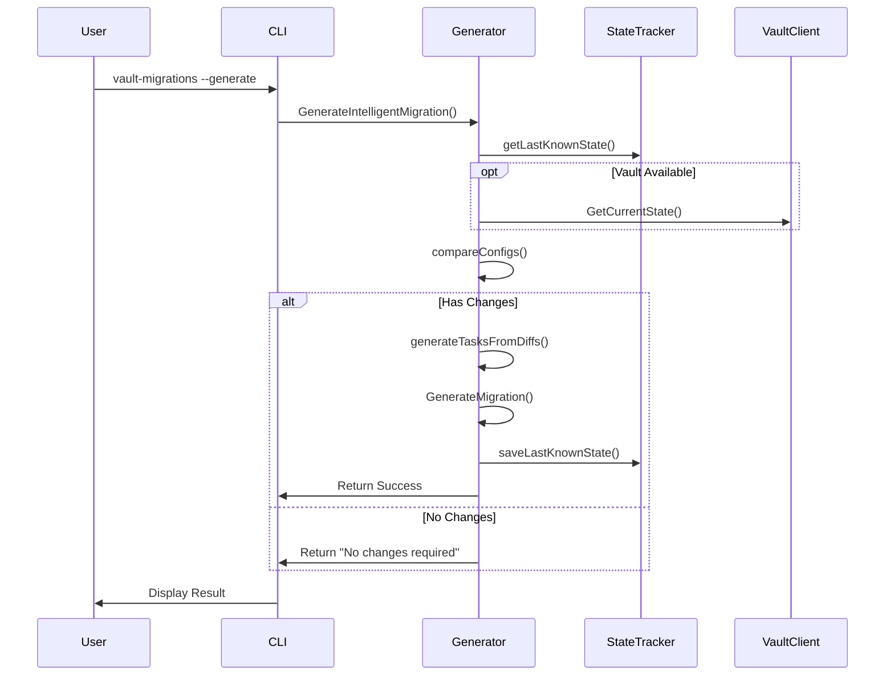
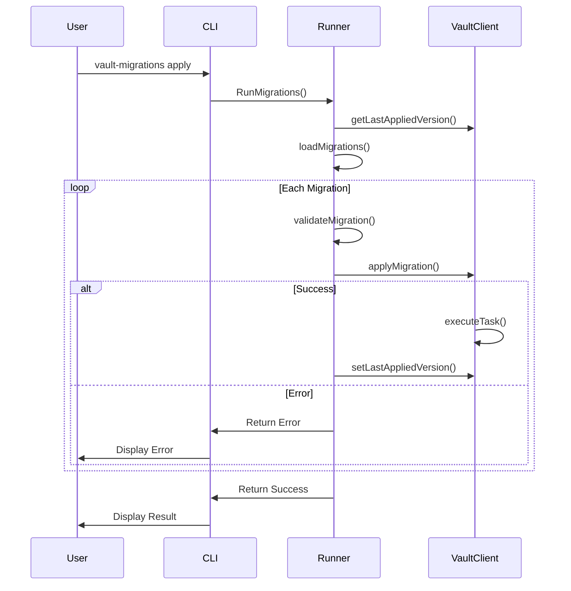
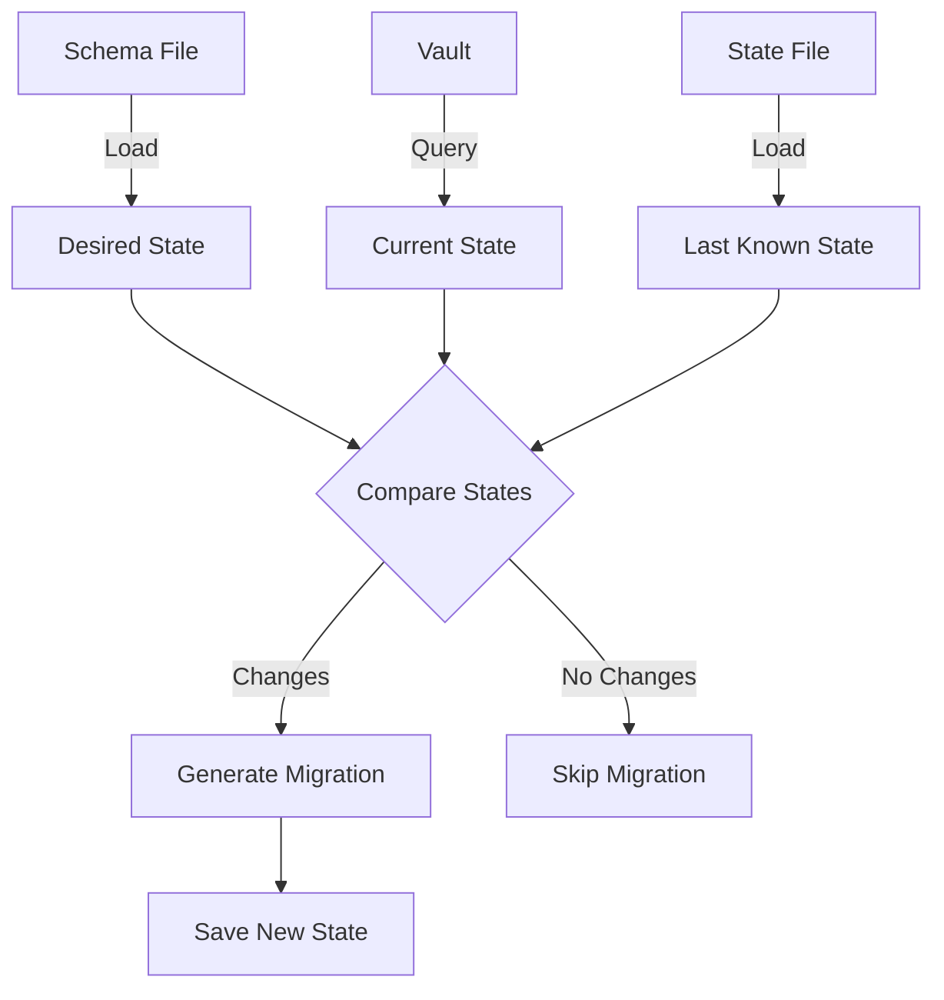

# Vault Migrations Architecture

## Overview

The Vault Migrations tool is designed to manage HashiCorp Vault configuration changes across different environments in a controlled and versioned manner. It follows a migration-based approach similar to database migrations, where each change is versioned and applied sequentially.

## Components

### Core Components

1. **Migration Runner**
   - Manages the execution of migrations
   - Tracks applied versions
   - Handles rollbacks and error recovery

2. **Vault Client**
   - Wraps the Vault API client
   - Manages authentication and connection
   - Retrieves current state
   - Executes operations

3. **Generator**
   - Creates intelligent migrations
   - Compares current and desired states
   - Tracks state between runs
   - Generates appropriate operations

4. **Configuration Manager**
   - Loads and validates configurations
   - Handles environment variable interpolation
   - Supports conditional validation modes

## Sequence Diagrams

### Migration Generation Flow



### Migration Application Flow



## State Management

### State Tracking


## Configuration Structure

### Schema Configuration
```yaml
desired_state:
  # Auth Methods
  auth/approle:
    type: approle
    config: {...}
  
  # Secret Engines
  pki/:
    type: pki
    config: {...}
  
  database/:
    type: database
    config: {...}
  
  # Policies
  sys/policies/acl/app-policy:
    policies:
      - path: {...}
```

## Error Handling

1. **Validation Errors**
   - Schema validation
   - Configuration validation
   - Migration format validation

2. **Runtime Errors**
   - Vault connection failures
   - Authentication failures
   - Operation failures

3. **Recovery Mechanisms**
   - State recovery
   - Partial application handling
   - Rollback support

## Security Considerations

1. **Authentication**
   - Token-based auth
   - AppRole support
   - Namespace isolation

2. **Access Control**
   - Least privilege principle
   - Policy-based access
   - Role separation

3. **Sensitive Data**
   - Environment variable interpolation
   - Secure credential handling
   - No sensitive data in logs

## Development Guidelines

1. **Code Organization**
   - Modular package structure
   - Clear separation of concerns
   - Interface-based design

2. **Testing**
   - Unit tests for core logic
   - Integration tests with Vault
   - Mock interfaces for testing

3. **Error Handling**
   - Descriptive error messages
   - Proper error wrapping
   - Contextual information

## Deployment

1. **Container Support**
   - Docker image
   - Kubernetes compatibility
   - CI/CD integration

2. **Configuration**
   - Environment variables
   - Configuration files
   - Command-line flags

3. **Monitoring**
   - Structured logging
   - Operation tracking
   - Error reporting

## Future Enhancements

1. **Feature Additions**
   - More secret engine support
   - Enhanced diff detection
   - Advanced rollback capabilities

2. **Performance Improvements**
   - Parallel operations
   - Caching mechanisms
   - Optimized state tracking

3. **Integration Enhancements**
   - CI/CD plugins
   - Cloud provider integration
   - Monitoring system integration
